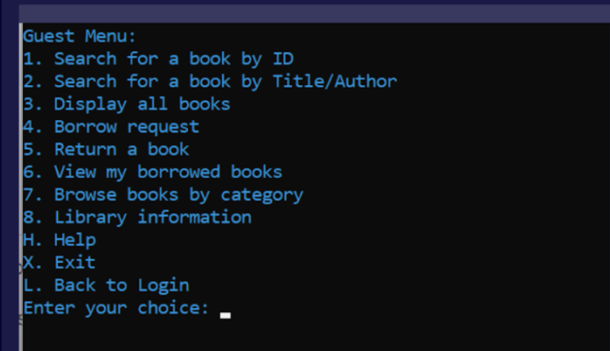
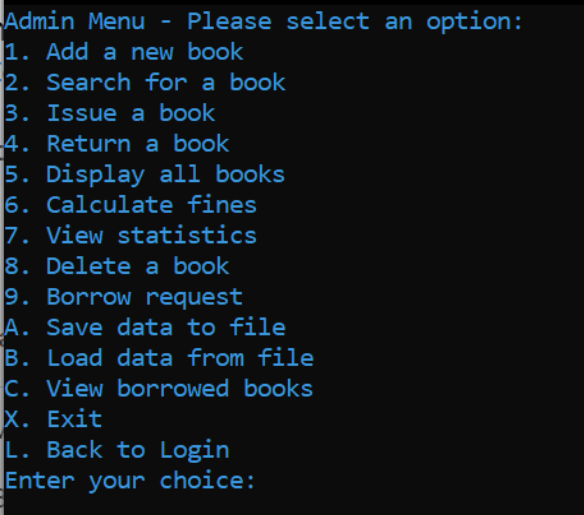
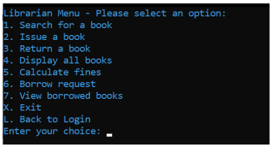

# Library Management System

<div align="center">
  





</div>

A robust, high-performance Library Management System implemented in x86 Assembly language. This system provides comprehensive functionality for managing library resources, user accounts, and administrative operations with exceptional performance and minimal resource usage.

## 📚 Features

### Core Functionality
- **Multi-User Role System**
  - Administrator: Complete system control
  - Librarian: Book and borrower management
  - Guest: Limited search and viewing capabilities

- **Book Management**
  - Add, search, and manage book inventory
  - Track book status (available, borrowed, etc.)
  - Categorize books with custom classification system
  - Delete books with proper validation checks

- **Borrowing Operations**
  - Issue books with due date tracking
  - Process returns with fine calculation
  - Track borrower history and privileges

### Advanced Features
- **Smart Fine Calculation**
  - Category-based fine rates
  - Automatic calculation based on days overdue
  - Configurable rate system

- **Statistical Analysis**
  - Real-time system statistics
  - Usage patterns and availability metrics
  - Category distribution reports

- **Data Persistence**
  - Binary file format for efficient storage
  - Data validation and integrity checks
  - Backup functionality

- **Terminal User Interface**
  - Color-coded display for enhanced readability
  - Intuitive navigation system
  - Responsive command processing

## 🔧 System Requirements

- Linux-based operating system
- NASM (Netwide Assembler) 2.14 or later
- x86 processor architecture
- Make build system

## 🚀 Installation

1. **Clone the repository**
   ```bash
   git clone https://github.com/Sunnahboy/Library-Management-System.git
   cd Library-Management-System
   ```

2. **Compile the system**
   ```bash
   make
   ```

3. **Run the application**
   ```bash
   ./library_system
   ```

4. **Optional: Install system-wide**
   ```bash
   sudo make install
   ```

## 🧰 Usage Guide

### Authentication

| Role | Username | Password |
|------|----------|----------|
| Administrator | `admin` | `admin123` |
| Librarian | `librarian` | `lib123` |
| Guest | No credentials required | |

### Navigation Commands

- Enter the number or letter corresponding to menu options
- Type `back` at most prompts to return to previous screens
- Press `X` from main menu to exit the program
- Press `H` for help (in Guest mode)

### Core Operations

#### Adding Books
```
1. Login as Administrator
2. Select "Add a new book"
3. Enter book details (ID, title, author, category, quantity)
4. Confirm addition
```

#### Searching Books
```
1. Select "Search for a book"
2. Choose search method (ID, title, or author)
3. Enter search criteria
4. View matching results
```

#### Borrowing Process
```
1. Login as Librarian or Administrator
2. Select "Issue a book"
3. Enter book ID and borrower information
4. Specify borrowing duration
5. Confirm issue
```

## 📁 Project Architecture

```
Library-Management-System/
├── main.asm              # Main program entry point
├── book_add.asm          # Book addition module
├── book_display.asm      # Book display functionality
├── book_issue.asm        # Book issuing operations
├── book_return.asm       # Book return processing
├── book_search.asm       # Search functionality
├── borrow_request.asm    # Borrowing request handler
├── borrowed_books.asm    # Borrowed books tracking
├── bss.asm               # Uninitialized data section
├── constants.asm         # System constants
├── data.asm              # Initialized data
├── delete_book.asm       # Book deletion module
├── file_io.asm           # File operations
├── fines.asm             # Fine calculation system
├── statistics.asm        # Statistical reporting
├── utility.asm           # Core utility functions
└── Makefile              # Build configuration
```

## 🛠️ Makefile Commands

| Command | Description |
|---------|-------------|
| `make` | Build the executable |
| `make debug` | Build with debugging symbols |
| `make clean` | Remove generated files |
| `make run` | Build and execute the program |
| `make install` | Install system-wide |
| `make uninstall` | Remove system installation |
| `make backup` | Create source backup archive |
| `make help` | Display available commands |

## 📊 Technical Specifications

- **Memory Usage**: Optimized for minimal memory footprint
- **Database Capacity**: Configurable up to 50 books by default
- **Response Time**: Near-instantaneous operations
- **File Format**: Custom binary format with integrity verification
- **Error Handling**: Comprehensive validation and graceful error recovery

## 🤝 Contributing

Contributions are welcome! Please follow these steps:

1. Fork the repository
2. Create a feature branch: `git checkout -b feature/new-feature`
3. Commit your changes: `git commit -m 'Add new feature'`
4. Push to the branch: `git push origin feature/new-feature`
5. Submit a pull request


## 📝 Documentation

Find here comprehensive documentation 
### [📄 View Full Documentation](https://docs.google.com/document/d/1cVzvWKBj2Te0J_eSTxYCdKJxfqdygi905hb-St-5FDM/edit?usp=sharing)

## 📜 License

This project is licensed under the MIT License - see the LICENSE file for details.

## 👏 Acknowledgments

- The x86 Assembly programming community
- Contributors to NASM and related tools
- Open source terminal UI design patterns
- This project was developed as part of the System programming low level Techniques (CT073-3-2-CSLT) course at Asia Pacific University of Technology & Innovation.

---

<div align="center">
  <sub>Built with ❤️ by Sunnahboy</sub>
</div>